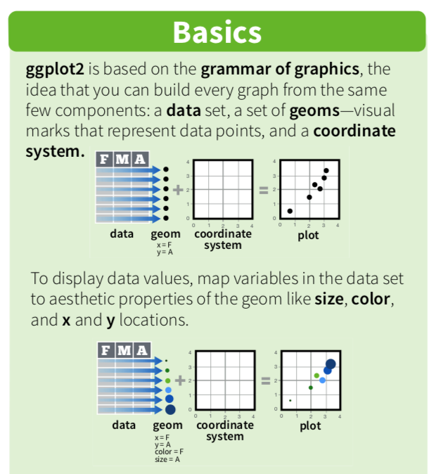

```{r setup, include=FALSE}
knitr::opts_chunk$set(echo = TRUE)
```

## Learning Objectives

1. Students will be able to distinguish bad visualizations from good visualizations, based on aesthetic principles of design.

2. Students will be able to label the different pieces of visualizations: data, aesthetics (mappings) and geoms (layers).

3. Students will be able to use skills developed in previous weeks (and from previous coursework) to successfully install new packages/modules, access helpfiles and understand the structure and summary of datasets.

3. Students will be able to write scripts that produce simple plots (histograms, scatter plots and boxplots) with base R (or matplotlib) plotting, and understand the basic syntax and structure of associated functions. 

4. Students will be able to think critically to use the grammar of graphics and ggplot to produce new visualizations using the expertise of their classmates, the basic syntax they learned in class, and the helpfiles associated with R (and with the web). 

## POGIL Group Setup:
### Students will be familiar with this setup as it will be employed throughout the course  

1. **Conceptor (Manager)** - In addition to managerial duties - does initial constructions of the what the figure should look like. Draws things, conceptualizes how the data will be presented. 

2. **Coder/Recorder** - the person writing the bulk of the code. Importing packages, annotating code throughout. Recording ideas.

3. **Error Checker (Reflector)** - In addition to reflector duties, this person responsible for debugging code, using helpfiles, etc. 

4. **Explainer/Presenter** - the person that will do the speaking out. Be able to explain the code and the rationale of each bit to the rest of the class. Should also explain the consensus of the group about what the data show us.

***  
## Day 1
## Part 1 - A Visualization Primer - (30 minutes)
  Some inspiring figures:  
http://www.r-graph-gallery.com/19-map-leafletr/  
http://www.r-graph-gallery.com/21-distribution-plot-using-ggplot2  
http://www.r-graph-gallery.com/274-map-a-variable-to-ggplot2-scatterplot/  
http://www.r-graph-gallery.com/123-circular-plot-circlize-package-2/  
  
  
### 1a. Why do visualizations matter? - Small Group Writing Activity

  *  Why are we spending so much time on visualization - why is this an entire course?
  * Take 3 minutes as individuals - write down your top 10 reasons why data visualization is important or useful to you?
  * Take 5 minutes with your group - compare your notes, come to a group consensus - rank the top 5 reasons from the group.
  * Have your *Presenter* write the group's reasons on the board, and we'll spend some time discussing.
  
### 1b. Types of visualization - big thinking about data

#### 1b.1 Small group activity  
  Within your group - what are all of the types of visualization you can think of. The Conceptor will draw them initially, then I'll draw them on the board during a report out.  
  

#### 1b.2 Activity - matching data types to visualization types  
  Matching activity in group - can you match the visualization to the data type. 
  
  File for activity is in the assets folder.  

### 1c Figure Critique - What makes a good data visualization?
  * Small mini-lecture on principles of data visualization and design.
    1. Some resources to build this: 
      a. https://www.fusioncharts.com/whitepapers/downloads/Principles-of-Data-Visualization.pdf
      b. https://moz.com/blog/data-visualization-principles-lessons-from-tufte
      c. http://stat.pugetsound.edu/courses/class13/dataVisualization.pdf
      d. http://paldhous.github.io/ucb/2016/dataviz/week2.html  
      
Full mini-lecture can be found in the assets folder. 
      
Figures:  

  1.   
  
  2.   
  
  3.   
  
  4.   
  
      
  * Students will examine and critique figures from primary literature in their groups. Each group
      will be passed a figure, students will take 15 minutes to try to interpret the figure, and
      generate a list of problems. Each group will also draw and present a reimagined version of the       figure that is better.
      
### End of Class  
## Day 2  

### 1d. Principles of Visualization - an Introduction into the Grammar of Graphics
#### 1d.1 Grammar of graphics flowchart
  * Hand out labeled pieces of paper to groups:
      1. A fake data frame  - a good resource for this might be the msleep data set (loaded with tidyverse)  
      2. A series of mappings based on that data frame (aesthetics) - this is sometimes a hard concept. Think about ways to visually represent the data.  
      3. A set of geometric objects (geoms)
      4. Annotations
      5. Coordinate system
  * Have students work in groups and try and develop a flow chart for how these things fit together.
  * It should look something like this: {width=50%}
  
  * Spend 5 minutes and discuss the different flowcharts, though everyone should probably be on the same page on this. 
  
#### 1d.2 Grammar of graphics deconstruction
  * Groups will work to decode a complex figure into its different graphical pieces
  
Here is the code and figure, based on the mtcars dataset.

```{r results = "hide", message=FALSE, error=FALSE}
#Loading Tidyverse with ggplot and all the goodies
library(tidyverse)
```

```{r plot_deconstruction}
#Scoping out what the data look like
head(mtcars)
#A data frame with a bunch of data on different cars.... cool. Let's plot a bunch of different variables.

#The plot they need to deconstruct
ggplot(data = mtcars, aes(x = log(mpg), y = log(hp), col = factor(cyl))) +
  geom_point(aes(size = wt), alpha = 0.6) +
  theme_classic() +
  theme() +
  labs(x = "log MPG", 
       y = "log Horsepower", 
       color = "Cylinders", 
       size = "Weight")
```
  
  * Show groups the Figure, not the code.  
  * Part 1 - Draw the Figure on paper. Have the group label each piece clearly.  
  * Report out. Show figure up on the screen and draw on/label each piece based on group feedback.  
  
## Part 2 - Basic Plotting in R (or Python with matplotlib)

### 2a Plotting 1 variable - the histogram - (10 minutes)  
We're going to be using a real data set for the next set of exercises. I'll live code below on how to get access to it. It's a big set of bike-share data from London, which shows bikeshare use (just like the Tucson bikeshare!), along with weather and other factors.  

For a python version of code to generate this exercise, check out the assets folder. 
  
```{r, tidy=TRUE, error=FALSE, message=FALSE}
# load up the tidyverse
library(tidyverse)
bikeshare = read_csv("../assets/london_merged.csv")

#quality control check using glimpse
glimpse(bikeshare)
```

  * Ask students what are the different columns here, and what do they mean?  
  1. timestamp (bikeshare use by hour)
  2. count of bikeshare uses  
  3. actual temperature
  4. feels like temperature  
  5. humidity  
  6. wind speed  
  7. weather code  (go to (kaggle for info on codes)[https://www.kaggle.com/hmavrodiev/london-bike-sharing-dataset])  
  8. is this day a holiday?  
  9. is this day a weekend day?  
  10. what season is it?  

      
  * We're going to start by plotting a basic histogram in base R. We want to see the distribution of values for bikeshare use.  
  
  * We're going to use the hist() function to accomplish this. Recall that a function usually takes parameters, hist is no different. 
      We need to feed it the right inputs to get the right outputs. 

```{r, histogram_code, tidy=TRUE}
#Call up the helpfile on hist
?hist

#Lots of parameters, but only one we really need is "x" - feed the function a vector. 
hist(bikeshare$cnt, main = "")
```

  * Cool. It worked. Everyone's worked, right? CHECK AND MAKE SURE EVERYONE HAS IT UP AND RUNNING! 
  
### 2b Making a histogram better by modifying parameters - (15 minutes)

  * Let's identify some problems with this figure: 
    1. The bins are too big, we need more resolution
    2. Our axis labels are not great. Let's make them better.
    
  * Get into your groups. Here is my challenge to you: produce a histogram using the hist() function on the `bikeshare$cnt` data that addresses 
      the issues we discussed. Copy and paste your script into an email and send it to me. 
      
  * In theory, their answers should look something like this:
```{r, good_hist, tidy=TRUE}
hist(bikeshare$cnt, breaks = 10, main = NULL, xlab = "New Bikeshares per Hour")
```

### 2c Plotting 2 variables (boxplots - 15 minutes)

  * One variable is great, but your data will often contain more than just one variable. Think about the rice data table. What do you think the scientists are interested in plotting?
  * What are some potential figures that data scientists could plot? What would the figures look like?
  * Take 5 minutes in your group. Have your manager/conceptor draw as many different types of figures as they can form the data. 
  * Put figures on the board - among these will probably be boxplots and maybe scatter plots? We'll talk about these next.
  
  * boxplot()
  * It's a function. You have to feed it parameters like anything else. Check out the helpfile.
  
#### Group Challenge Assignment - Make a boxplot
  * Construct a boxplot that plots the number of new bikeshares per hour (`bikeshare$cnt`) as a function of each season. 
  * It should have nice labels (Hint: you'll want to feed the function the ylab parameter)!
  
``` {r}
boxplot(cnt ~ season, data = bikeshare, ylab = "Total number of new rideshares")

```

  * It's probably worth saying here that it's probably worth mentioning that not everyone will know what the different pieces of the boxplot mean... and that's ok. They've all probably seen figures like this before though. We'll talk about the measures later.
  
  
#### Group Challenge Assigment - make a scatter plot (15 minutes).
  * Same as above - different data though. Use the bikeshare data set, plot cnt versus t2, using the plot() function. 
  
  * plot() is a more general function, we have to specify some extra information, like the type of plot we want it to spit out. 
  
  * See if you can figure it out from the helpfile in your groups. 
  
There plot should look something like this:
``` {r}

plot(y = bikeshare$cnt, x = bikeshare$t2, pch = 16, ylab = "Number of new bikeshares/hour",
     xlab = "Temperature Perception (ºC)")
```

## End of Class  
## Day 3
### 3 An introduction to ggplot2 (45 minutes)
#### 3a. An Introduction to the Grammar of Graphics in ggplot2

  * You already know this. It's what we worked on in the first part of class. 
  * Different pieces: Data, Mappings (aesthetics), geoms, attributes.

Let's look at some base-R code:

```{r, eval=FALSE}
plot(bikeshare$t2, rice$cnt, pch = 16, xlab = "Perceived temperature (ºC)",
     ylab = "New rideshare count/hour"))
```

  * Talk through the pieces above - the syntax is a bit weird.
    1. Mappings are mixed with data, attributes in the same string
    2. There aren't really different ways to put different geoms on the thing.
    3. No way to layer.

  * There is an additional package that is used by a lot of people called ggplot2 that
      makes constructing graphs more in line with the grammar of graphics framework, and generally  
      allows you to make some really damn pretty figures.
      
First things first, you'll need to download and install the packages:

```{r results = "hide", message=FALSE, error=FALSE}
#Loading Tidyverse with ggplot and all the goodies
library(tidyverse)
```

  * First things first, let's check out the helpfile. The package is ggplot2, the function is simply     ggplot.
  * `{r} ?ggplot `
  * Give them some time to read through the helpfile, then break it down. 
    a. What is the name of the function, what are the first things you need to feed the function?
    b. Data, mappings. ` {r} ggplot(bikeshare, aes(x = t2, y = cnt)) `
    c. Run this code above. What happens? NOTHING! Why? Because we didn't include any geometries. :)
    
```{r} 
ggplot(bikeshare, aes(x = t2, y = cnt)) +
  geom_point()
```

Boom! We've got the graph we did in base R above (more or less). Here is how to change the labels, and use a theme that is a bit less clouded.

```{r} 
ggplot(bikeshare, aes(x = t2, y = cnt)) +
  geom_point() + 
  xlab("Perceived Temperature (ºC)") +
  ylab("New Bikeshare Count/Hour") +
  theme_classic()

```

We can change attributes within geoms - imagine you wanted the points to be bigger.
```{r} 
ggplot(bikeshare, aes(x = t2, y = cnt)) +
  geom_point(size = 4) + 
  xlab("Perceived Temperature (ºC)") +
  ylab("New Bikeshare Count/Hour") +
  theme_classic()

```

And... we can layer on other geometries. Imagine you wanted to add a trendline with a 95% confidence interval to this figure, and make the points a little transparent to prevent overplotting. 
```{r} 
ggplot(bikeshare, aes(x = t2, y = cnt)) +
  geom_point(size = 2, alpha = 0.1) +
  geom_smooth(method = "lm") +
  xlab("Perceived Temperature (ºC)") +
  ylab("New Bikeshare Count/Hour") +
  theme_classic()
```


#### 3b - ggplot challenge.

I'm going to show you a figure on the board from the bikeshare data set. Your job is to replicate the figure within your group (hint: search the web for 'faceting ggplot2')

``` {r, echo = FALSE} 
ggplot(bikeshare, aes(x = t2, y = cnt, color = as.factor(is_holiday))) +
  geom_jitter(size = 1, alpha = 0.3) + 
  labs(x = "Perceived Temperature (ºC)",
       y = "New Bikeshare Count/Hour", 
       color = "Holiday") +
  theme_classic() +
  facet_wrap(~ is_holiday)
  
```

#### Reflector assignment (10 minutes)  
  * Write a 1 paragraph summary of some of the challenges your group faced while working through these exercises. 
      Focus on how you divided the workload based on your group job assignments, and how you worked through those challenges as a group. 
      What would you try and do differently in the next module as a group to alleviate some of these challenges?  
  * Upload this reflection to D2L (be sure to include your group name).  
  * (For testing purposes - have the reflector lead a one-up-one down - do this in Google Sheets: Log of one-up-one-down, and a reflection of how you think the group did)